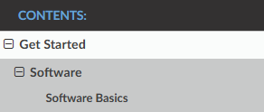

# Contributing to the OpenCyberCity Docs

#### Hopefully, you already know how to write Markdown. If not, check out the [Markdown Guide](https://www.markdownguide.org/).

#### The site is built with [Sphinx](https://www.sphinx-doc.org/) using [MyST](https://myst-parser.readthedocs.io/) (Markdown for Sphinx).

> **Just want instructions?** Go to the  [Step by Step Instructions](#step-by-step-instructions). The ramblings above it explains why i did things the way they are done, if you don't care (ouch), just go to instructions.

---

## How it works

Unlike a normal website, Sphinx does **not** figure out the navigation tree from the folder structure. You declare the everything explicitly with `toctree` directives written inside your Markdown. You only have to understand two things: **landing pages** and **toctrees**.

### Landing pages

A **landing page** is a `.md` file that sits beside a folder of the same name. It's the parent of everything in that folder. This pairing is the one convention to remember, every section that has children is **a `.md` file next to a folder of the same name**:

```
docs/source/
|-- get_started.md              <- landing page
|-- get_started/                <- its child pages
    |-- software.md             <- a sub-section landing page
    |-- software/               <- its child pages
        |-- software_basics.md  <- a child page
```

And it nests as deep as you need (`get_started.md` → `get_started/software.md` → `get_started/software/software_basics.md`). In the sidebar that becomes:



**Why is the landing page outside the folder?** Because it's the parent of those pages, not one of them. Sphinx identifies every page by a "docname", its path under `source/` without the extension:

| File | docname | URL |
|------|---------|-----|
| `usage.md` | `usage` | `/usage.html` |
| `usage/street_lights.md` | `usage/street_lights` | `/usage/street_lights.html` |

Because `usage.md` lives beside the folder, its docname is simply `usage`, which makes it the parent of everything named `usage/...`. Move it inside as `usage/index.md` and its docname becomes `usage/index`, now it's a sibling of its own children and the parent/child relationship breaks. So: **landing page beside the folder, never inside it!!!**

### Toctrees

A `toctree` (table of contents tree) is what a landing page uses to declare its children. Here's `usage.md`:

````markdown
# Usage

How to operate the OpenCyberCity systems.

```{toctree}
:maxdepth: 1
:glob:

usage/*
```
````

What everything does:

- ` ```{toctree} ` ... ` ``` ` — the directive block.
- **`:maxdepth:`** — how many levels deep to show under this entry in the sidebar. `1` shows just the immediate children; higher numbers expand grandchildren inline.
- **`:glob:`** — lets you use `*` wildcards in the body instead of listing every page by hand.
- **`:caption: Some Title`** — adds a bold heading above the group in the sidebar (the "CONTENTS:" label comes from `index.md`'s caption).
- **`:hidden:`** — still adds the pages to the nav tree, but doesn't print the clickable list in the page body.
- **The body (`usage/*`)** — one entry per line. Each line is a docname, or a `*` pattern when `:glob:` is on.

A couple things to remember:

- **`*` only works with `:glob:`.** Without it, Sphinx reads `usage/*` as a literal page name, fails to find it, and warns. The `*` does nothing on its own.
- **Glob paths are relative to the file.** `usage.md` writes `usage/*`, but `usage/street_lights.md` writes just `street_lights/*` (not `usage/street_lights/*`), because paths resolve relative to the folder the `.md` lives in. Glob also only matches one level down, deeper folders get pulled in by their own landing page's toctree.
- **Glob is alphabetical.** To control the order, drop `:glob:` and list pages explicitly instead:
  ````markdown
  ```{toctree}
  usage/street_lights
  usage/traffic_lights
  ```
  ````

### `index.md` is the root

`docs/source/index.md` is the **root** of the whole site. It's the one toctree that lists the top-level sections **explicitly** (no `:glob:`) so we control their order by hand:

````markdown
```{toctree}
:maxdepth: 2
:caption: Contents:

get_started
device_setup
architecture
usage
```
````

Reorder those lines to reorder the top-level sidebar (written out explicitly so Get Started shows up at the top instead of being alphabetized).

### Linking between pages and sections

**Don't hardcode `.html` paths, and don't use the `{doc}`/`{ref}` roles.** We link to everything, pages and sections, the same way: with normal Markdown link syntax pointing at a **label**.

```markdown
[link text](label-name)
```

A label is a tag you place on the line directly above a heading, written `(label-name)=`. For example, `nmap.md` starts with:

```markdown
(nmap-instructions)=
# How to use `nmap`
```

...so any page can link to it with `[here](nmap-instructions)`. Labels are keyed to the **label name, not the file path or heading text**, so these links survive you moving files around or reordering sections.

#### The procedure (follow this every time)

For each page or section (any Markdown `#` heading) you want to link to:

1. **Go to it** and look for a label (`(something)=`) right above the heading.
2. **If a label already exists, reuse it.** Just write `[your text](that-label)`. Do **not** make a second one.
3. **If there's no label, create one** above the heading, following the naming rules below, then link to it.

#### Naming rules (please do this)

Labels are **global across the entire site** and must be unique, so name them predictably:

- **Page / title label** (above a page's top-level `#` title): a short **1–2 word** label, words joined by `-`.
  - e.g. `nmap-instructions`
  - e.g. `pi-setup`
- **Section label** (above any non-`#` heading inside a page): **`<doc-or-title>-<section-name>`**.
  - e.g. `pi-setup-static-ip` (the "Set a static IP" section of the Pi setup guide)

So creating and using a section label looks like this:

````markdown
(pi-setup-static-ip)=
## Set a static IP address
````

```markdown
Make sure you've done the [static IP setup](pi-setup-static-ip) first.
```

> **Not sure if a label name is okay, or whether something fits the convention? Ask before merging.** Better to do it before adding references to it.

---

## Step by Step Instructions

### Add a page to an existing section

1. Drop the `.md` file into that section's folder, e.g. `usage/launch.md`.
2. Done. The landing page (`usage.md`) globs `usage/*`, so it's picked up automatically (alphabetically).

### Add a brand-new top-level section

Say you want a "factory" section:

1. Create the landing page `docs/source/factory.md` with a title, an intro, and a toctree that globs its folder:

   ````markdown
   # Factory

   idk factory stuff

   ```{toctree}
   :maxdepth: 1
   :glob:

   factory/*
   ```
   ````

2. Create the folder `docs/source/factory/` and add child pages there (e.g. `factory/arm.md`).
3. Add `factory` to the toctree in `index.md`, in the position you want it.

### Add a nested subsection (a child that itself has children)

Same pattern, one level down. Inside `factory/`, create `arm.md` next to an `arm/` folder, give `arm.md` a toctree globbing `arm/*`, and put the deeper pages in `arm/`.

### Reference another page or section

Always link via a **label** with plain Markdown syntax (see [Linking between pages and sections](#linking-between-pages-and-sections) for the full convention). To point readers at another page or section:

1. **Open the target** and check for an existing label (`(something)=`) above the heading.
2. **If there's already a label, just use it.** The Pi guide links to the nmap page this way:
   ```markdown
   If you are not familiar with `nmap`, follow the guide [here](nmap-instructions).
   ```
3. **If there's no label, add one** above the heading (following the naming rules), then link to it. The Pi guide's static IP step is labeled like this:
   ````markdown
   (pi-setup-static-ip)=
   5. **Set a static IP address for the Raspberry Pi.**
   ````
   ...and gets linked from anywhere with:
   ```markdown
   Make sure you've done the [static IP setup](pi-setup-static-ip) first.
   ```
4. Rebuild and watch the build output, a broken link shows up as a warning (and since we build with `-W`, it'll fail the build outright).

---

## Build and preview your changes

All commands run from the `docs/` directory.

```bash
make rebuild   # clean + full HTML build
make serve     # clean + build, then serve at http://localhost:8000
```

**Use `make rebuild` (instead of `make html`) after changing any toctree or moving files.** Sphinx leaves weird build artifacts sometimes (dw i put in an issue).

`make serve` rebuilds and then launches a local webserver to host the site, use it instead of double-clicking the HTML file. Opening pages directly via `file://` causes some issues (search previews break, for one). You can pass a different port with `make serve PORT=9000`.

**If you want to learn more, <a href="https://en.wikipedia.org/wiki/RTFM">RTFM.</a> Here is the link: <a href="https://www.sphinx-doc.org/">manual (docs)</a>. Half of this was copy/pasted from there anyway**
