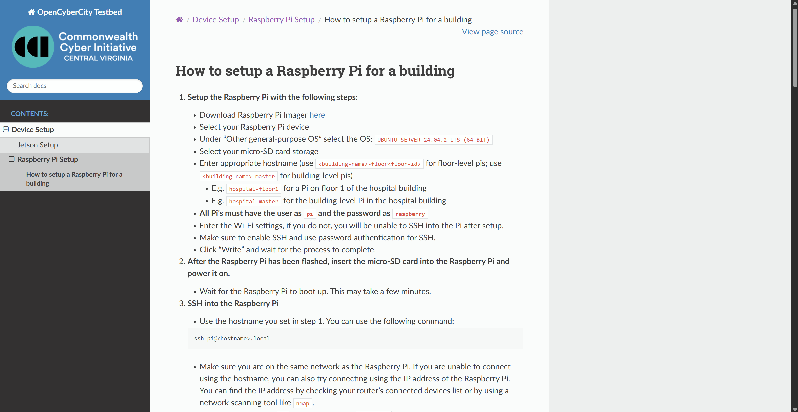
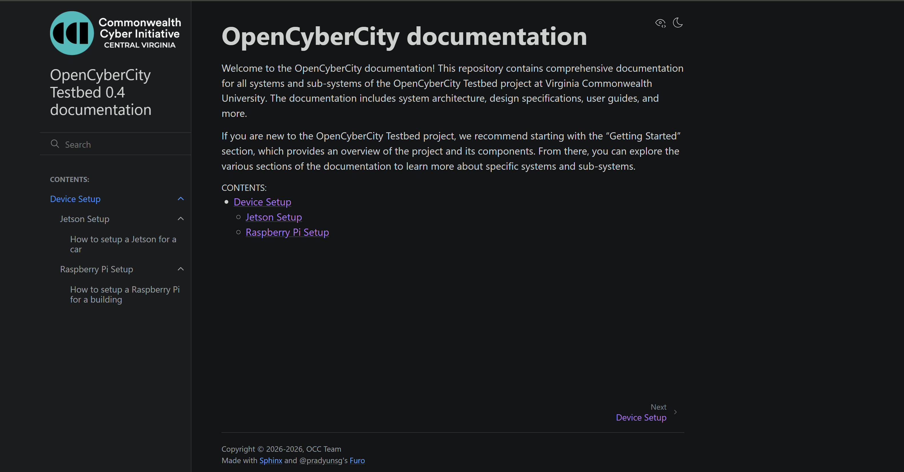
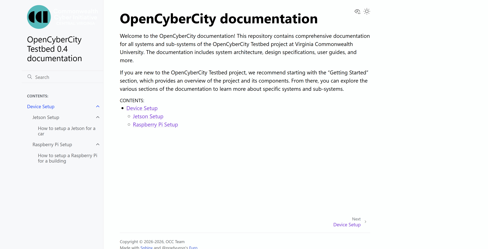

# OpenCyberCity Testbed Documentation

This repository contains the documentation for the OpenCyberCity Testbed project, including system architecture, design specifications, and user guides.

# Features

- **Built with Sphinx**: The documentation is built using the Sphinx documentation generator, which allows for easy creation of professional-looking documentation.
- **Markdown Support**: The documentation is written in Markdown, making it easy to read and write. No need to learn reStructuredText (reST), or write HTML. Any exisiting documentation can be easily ported to this repository.
- **Automatic Table of Contents**: The documentation includes an automatically generated table of contents, making it easy to navigate through the different sections.

# Planned Features

- **Search Functionality**: The documentation will include a search feature, allowing users to quickly find the information they need.
- **Build Automation**: The documentation will be automatically built upon changes and deployed to a web server, ensuring that the latest version is always available to users.
- **No-cost Hosting**: The documentation will be hosted using GitHub Pages, making it accessible to all users without any cost.

# Preview

Here is what the documentation looks like when built and served locally with different themes.

## Sphinx RTD


## Furo (Dark)
> **Note:** The Furo theme **automatically switches** between light and dark mode based on your system settings.



## Furo (Light)


# How to Preview the Documentation
The documentation is still in developement and is not yet deployed.

If you wish to preview the documentation, you can do so by following these steps:

1. Clone the repository to your local machine.
    ```bash
    git clone https://github.com/vcuopencity/occ_docs.git
    ```
2. Navigate to the cloned repository.
    ```bash
    cd occ_docs
    ```
3. (Recommended) Create a virtual environment to manage dependencies.
    ```bash
    python -m venv venv
    source venv/bin/activate
    ```

4. Install the required dependencies.
    ```bash
    pip install -r requirements.txt
    ```

5. Navigate to the `docs` directory and build the documentation.
    ```bash
    cd docs
    make html
    ```

6. Open the generated HTML files in your web browser. You can find the main page at `docs/build/html/index.html`.
    - If you are on native Ubuntu, you can use the following command to open the main page in your default web browser:
    ```bash
    xdg-open build/html/index.html
    ```

    - If you are on WSL, you can use the following command to open the main page in your default web browser:
    ```bash
    wslview build/html/index.html
    ```

# Contributing to the Documentation

Check out the [CONTRIBUTING.md](CONTRIBUTING.md) file for more information on how to contribute to the documentation.